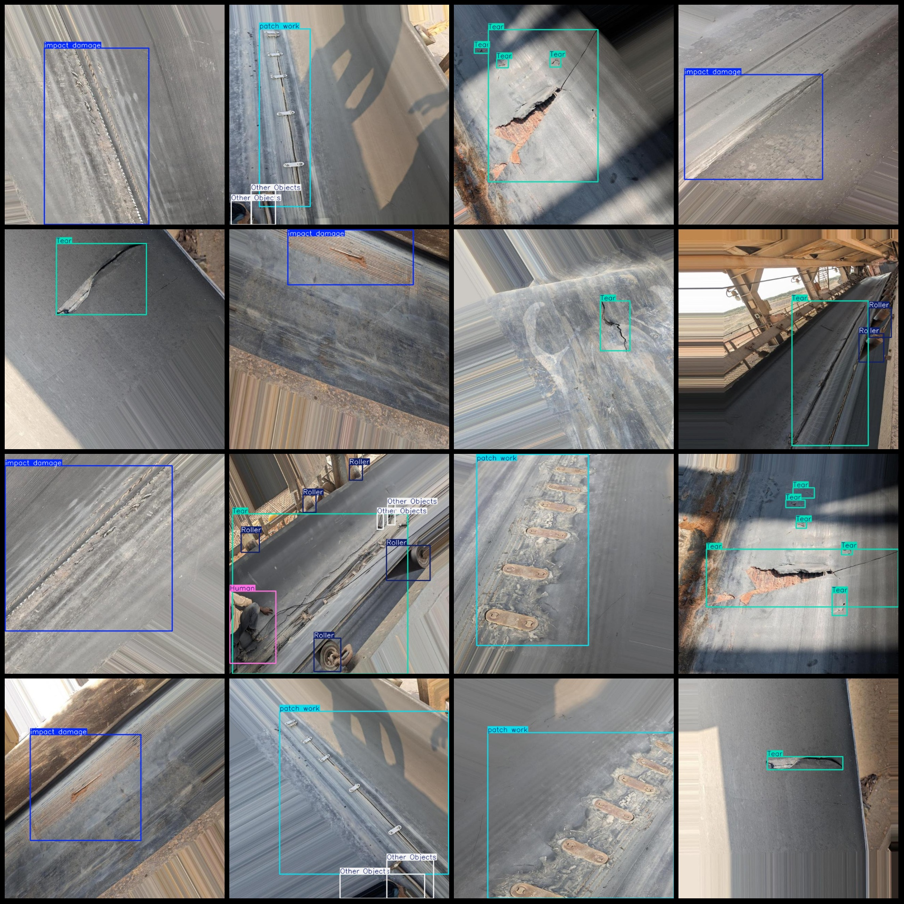
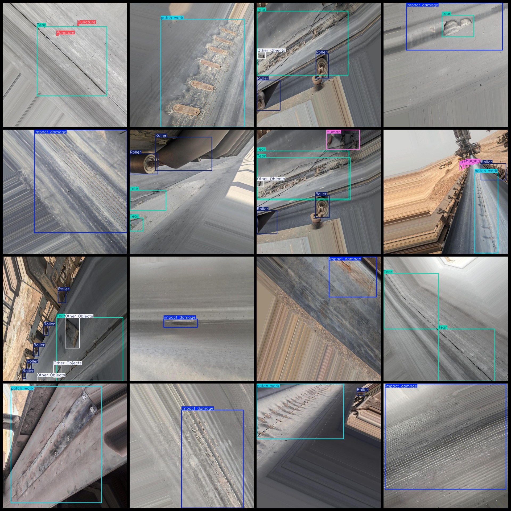

# Dataset for Damage Detection of Transmission Belts: VOC+YOLO Format with 918 Instances and 8 Categories

The dataset format is Pascal VOC format + YOLO format. The file does not contain the split path, only the jpg images and the corresponding VOC format xml files and yolo format txt files.

**number of images: ** 918

**annotation count: ** 918

918

**Category Number:** 8

["Hole", "Human", "Other Objects", "Puncture", "Roller", "Tear", "impact damage", "patch work"]

**boxes per class: **
- Holebox count = 42
- Humanbox count = 118
- Other Objectsbox count = 130
- Puncturebox count = 120
- Rollerbox count = 681
- Tearbox count = 691
- impact damagebox count = 283
- patch workbox count = 405

**total boxes: ** 2470

**Each category occupies a certain number of images:**
- Hole images = 42
- Human images = 77
- Other Objects images = 68
- Puncture images = 40
- Roller images = 276
- Tear images = 436
- impact damage images = 262
- patch work images = 346

The resolution of the image is 640x640.

**Using the labeling tool:** labelImg

Annotation rule: Draw a rectangle around the class.

**Important notes:** Dataset does not have separate training, validation, and test sets. You need to partition them yourself.

**Special Disclaimer:** This dataset does not guarantee the accuracy of the trained model or weight files.

<image>
## Images

Here is a pay link on Stripe ( https://buy.stripe.com/3cs8yP7sY87d0vu9AB ). Please contact me lonlonago@foxmail.com after funding $89, and I will send you a complete data files , thank you!

